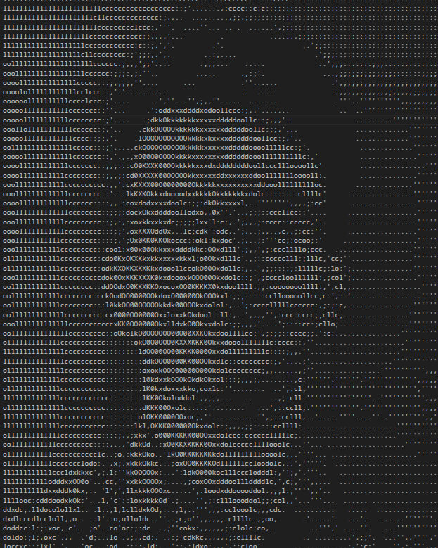

<table>
  <tr>
    <td valign="top" align="left" width="45%">
<pre>

</pre>
    </td>
    <td valign="top" align="left" width="55%">
      <b><code>A-JUDE-25120@github</code></b> 
      ─────────────────────────────────────────── 
      • <b>Role:</b> Mechatronics Engineer 
      • <b>Kernel:</b> EndeavourOS  
      • <b>Uptime:</b> 3rd Year Student 
      • <b>Age:</b> 20 
      • <b>Email:</b> <a href="mailto:adarshjude23@gmail.com">adarshjude23@gmail.com</a> 
      • <b>Hardware:</b> <code>ESP32</code> • <code>STM32</code>  
      • <b>Software:</b> <code>Solidworks</code> • <code>MATLAB </code> <code>C/C++</code> • <code>Python</code> • <code>MATLAB</code> • <code>LATEX</code> 
      • <b>Projects:</b> <a href="https://github.com/A-JUDE-25120/BOX_OF_SCRAPS">BOX OF SCRAPS</a> 
    </td>
  </tr>
</table>
        

<h3 align="center">📊 GitHub Activity & Stats</h3>

  
  

  

